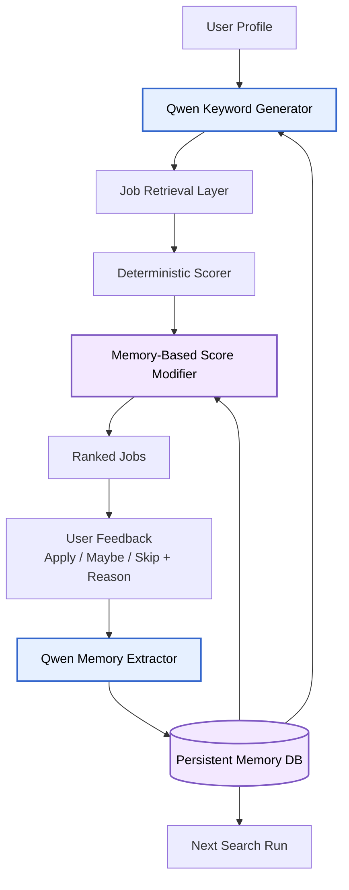

---
layout: post
title: "Building Qwench the Job Search with Qwen Cloud"
date: 2026-07-07 10:00:40
blurb: "A look at how I built a memory-driven job search agent that learns from feedback, improves keywords, and adjusts job scoring with Qwen Cloud."
og_image: /assets/img/content/post-example/Banner.jpg
-----------------------------------------------------

Job search is usually treated as a matching problem: compare a resume to a job description, calculate a score, and rank the results. But while building **Qwench the Job Search**, I ran into a more fundamental bottleneck: the wrong keywords return the wrong jobs.

A candidate can be a strong fit for experimentation, causal inference, product analytics, or applied data science roles, but those jobs do not always appear under obvious titles. They might be called **Decision Scientist**, **Experimentation Scientist**, **Product Data Scientist**, **Applied Scientist**, or something else entirely. Meanwhile, broad keywords like “Machine Learning Engineer” can return jobs that look relevant by skill overlap but are actually infrastructure-heavy, platform-focused, or not aligned with the candidate’s preferences.

That observation became the core motivation for this project: instead of building a one-shot job scraper, I wanted to build a memory agent that learns from feedback and improves the next search.

#### Table of Contents

1. [Project Idea](#project-idea)
2. [Why Memory Matters](#why-memory-matters)
3. [Architecture](#architecture)
4. [How Qwen Cloud Fits In](#how-qwen-cloud-fits-in)
5. [Memory-Based Scoring](#memory-based-scoring)
6. [What I Built](#what-i-built)
7. [Challenges](#challenges)
8. [What I Learned](#what-i-learned)
9. [What’s Next](#whats-next)

#### PROJECT IDEA

**Qwench the Job Search** is a memory-driven job search agent for adaptive job discovery.

The system starts with a candidate profile and generates an initial set of job-search keywords. It retrieves jobs, scores them, and asks the user for feedback such as **apply**, **maybe**, or **skip**, along with a short reason.

That feedback is then passed to **Qwen Cloud**, which converts it into structured memory. The backend validates the memory and stores it in a database. On the next search run, the backend retrieves relevant memories and uses them to generate better keywords and adjust job scoring.

The core loop is:

```text
profile → keywords → jobs → scores → user feedback → Qwen memory extraction → memory DB → better keywords and score modifiers
```

The goal is not just to rank jobs better. The goal is to improve the search process itself.

#### WHY MEMORY MATTERS

A typical job search workflow forgets everything after each search. If I skip five infrastructure-heavy ML platform jobs, the next search may still return the same type of roles. If I apply to experimentation and causal inference jobs, the system may not remember that signal.

Qwench keeps two kinds of memory.

##### User preference memory

User preference memory captures what the candidate actually likes or dislikes in job roles.

For example, if the user skips multiple jobs because they are too infrastructure-heavy, the system may create a memory like:

```json
{
  "memory_type": "negative_preference",
  "content": "User avoids infrastructure-heavy ML platform roles involving Kubernetes or model serving.",
  "tags": ["ML platform", "Kubernetes", "model serving"],
  "applies_to": ["keyword_generation", "scoring"],
  "confidence": 0.86
}
```

If the user applies to roles involving experimentation and causal inference, the system may create:

```json
{
  "memory_type": "positive_preference",
  "content": "User prefers roles involving experimentation, causal inference, and product decision-making.",
  "tags": ["experimentation", "causal inference", "product data science"],
  "applies_to": ["keyword_generation", "scoring"],
  "confidence": 0.9
}
```

This memory answers the question:

```text
What kinds of jobs does this user actually want?
```

##### Keyword return memory

Keyword return memory captures how well each search keyword performed.

For example:

```json
{
  "memory_type": "keyword_performance",
  "content": "Keyword 'machine learning engineer' returned many infrastructure-heavy jobs with low feedback quality.",
  "tags": ["machine learning engineer", "ML platform", "infrastructure"],
  "applies_to": ["keyword_generation"],
  "confidence": 0.82
}
```

This memory answers a different question:

```text
Which keywords actually return good jobs for this user?
```

That distinction is important. A user may prefer causal inference roles, while the system may learn that “experimentation scientist” is a better search keyword than “data scientist” for finding those roles.

#### ARCHITECTURE

The memory loop looks like this:



In this architecture, Qwen Cloud is used for the reasoning-heavy parts of the system. The database owns persistence. The backend owns validation, retrieval, and scoring.

The important design choice is that memory is not just chat history. Memory is structured, stored, retrieved, and applied to future decisions.

#### HOW QWEN CLOUD FITS IN

Qwen Cloud is used in two main places.

First, Qwen generates better search keywords. It receives the candidate profile, active memories, previous keywords, and prior search outcomes. Then it proposes new keywords that are more aligned with the user’s preferences.

For example, after feedback shows that the user prefers experimentation and causal inference roles, Qwen may suggest:

```text
experimentation scientist
causal inference data scientist
decision scientist
product data scientist experimentation
```

Second, Qwen extracts memory from feedback. User feedback is often messy and short, such as:

```text
Skip this one. Too much Kubernetes and model serving.
```

Qwen converts that into structured memory JSON. The backend then validates it before saving it to the database.

Qwen does not directly write to the database. Instead, the backend asks Qwen for structured output, validates the result, filters low-confidence memories, and stores only accepted records.

This makes the system easier to inspect and debug.

#### MEMORY-BASED SCORING

The system uses a deterministic scorer to calculate a baseline job match score. After that, a memory-based score modifier adjusts the score using stored memories.

For example, an ML platform job might start with a strong baseline score because it mentions Python, machine learning, and data pipelines. But if the user has repeatedly skipped infrastructure-heavy roles, the memory modifier can reduce the final score.

```text
ML Platform Engineer
base score: 78
memory adjustment: -10
final score: 68
reason: matched negative memory about ML platform and model serving
```

Another job might move up because it matches positive memories:

```text
Experimentation Scientist
base score: 74
memory adjustment: +7
final score: 81
reason: matched positive memory about experimentation and causal inference
```

I like this design because it keeps the ranking transparent. The base score and memory adjustment are separate, so I can see exactly why a job moved up or down.

#### WHAT I BUILT

For the hackathon demo, I kept the project focused on the core memory loop.

The demo includes:

* a candidate profile,
* baseline keyword generation,
* job retrieval or fixture job data,
* deterministic scoring,
* user feedback capture,
* Qwen-powered feedback-to-memory extraction,
* persistent memory storage,
* keyword-performance memory,
* memory-conditioned keyword generation,
* memory-based scoring modifiers,
* before-and-after comparison.

A successful run looks like this:

```text
Run 1:
Generic keywords return noisy results.

User feedback:
Skip infrastructure-heavy ML platform roles.
Apply to experimentation and causal inference roles.

Memory update:
The agent stores user preference memory and keyword return memory.

Run 2:
The agent generates better keywords:
- experimentation scientist
- causal inference data scientist
- decision scientist
- product data scientist experimentation

Scoring update:
Jobs matching positive memories move up.
Jobs matching negative memories move down.
```

The point of the demo is to show that memory changes future behavior. The system is not just producing a one-time answer. It learns from the previous search and improves the next one.

#### CHALLENGES

The biggest challenge was deciding where the LLM should be used.

It is tempting to ask the LLM to do everything: scrape jobs, score jobs, store memory, retrieve memory, and decide what to do next. I avoided that design. Instead, I used Qwen for language reasoning and kept the rest of the system deterministic.

Qwen extracts memory and generates search strategies. The backend validates JSON, stores memory, retrieves relevant records, computes keyword-performance metrics, and applies transparent scoring modifiers.

Another challenge was defining useful memory. I did not want memory to become a vague conversation log. Each memory needs evidence, confidence, tags, and a clear purpose. Some memories apply to keyword generation. Some apply to scoring. Some may become stale later.

#### WHAT I LEARNED

The main lesson is that job search is not only a ranking problem. It is also a search-space discovery problem.

Better scoring cannot fully solve the problem if the keywords never retrieve the right jobs in the first place. A memory agent can help by learning which job-title patterns, role attributes, and search terms work for a specific candidate.

I also learned that memory agents need structure. Useful memory should be stored outside the LLM context window, retrieved deliberately, and validated before it affects future behavior.

Qwen Cloud was most useful when it was part of a larger system: the LLM handled reasoning, while the backend handled persistence, validation, scoring, and control flow.

#### WHAT’S NEXT

The next step is to turn the local demo into a fuller agentic workflow.

Planned improvements include:

* LangGraph orchestration for stateful agent runs,
* FastAPI endpoints for external access,
* n8n integration for scheduled searches and notifications,
* Google Sheets or a lightweight UI for job review,
* cloud database support,
* embedding-based memory retrieval,
* memory consolidation and forgetting,
* resume and cover-letter generation based on selected jobs.

The long-term vision is a job-search agent that behaves more like a personal recruiter: it remembers what the candidate actually wants, learns which search strategies work, and improves every round of job discovery.
